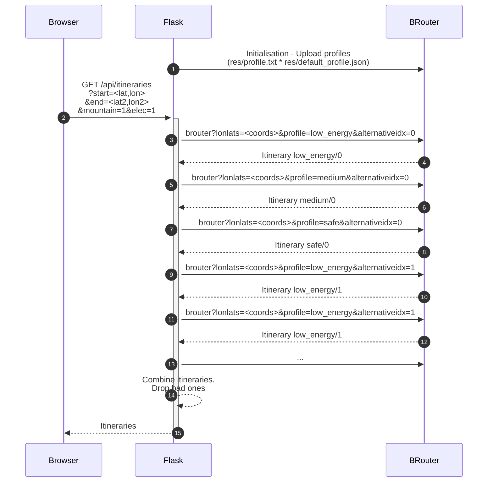

# Instructions MIG energy

Ce document donne des informations / resources utiles au MIG energie 2024, centré sur la mobilité.

# Objectif 

L'objectif est d'utiliser / combiner des services web existant pour optimiser les parcours en vélo électrique solaire.

Ce travail peut s'appuyer sur deux outils :
* [Safecycle](https://safecycle.atelier-des-communs.fr/) Une appli web, open source et gratuite, d'itinéraires à vélo. 
* [WPS](https://git.sophia.mines-paristech.fr/oie/wps-client) Un service web de calcul d'irradiation solaire, prenant en compte les ombrage, développé par le [centre O.I.E](https://www.oie.minesparis.psl.eu/Accueil/) 

# Safe Cycle

## Présentation du service

[Safecycle](https://safecycle.atelier-des-communs.fr/) est une interface web open source de calcul d'itinéraire à vélo.

C'est une interface au service Web [Brouter.de](https://brouter.de/), lui-même basé sur les données de [OpenStreetMap](https://www.openstreetmap.org)

Safecycle fournit ses propres [profils d'optimisation](https://brouter.de/brouter/profile_developers_guide.txt) à Brouter, pénalisant les routes non protégées, 
mais autorisant les chemins (si l'option VTT est activée). 

Safecycle est développé en Python et utilise le framework Web [Flask](https://flask.palletsprojects.com/en/stable/)

Il combine plusieurs résultats de Brouter.de en une seule interface présentant différentes alternatives pertinentes.

## Adaptation au MIG

Dans le cadre du MIG énergie, nous avons préparé une [branche dédiée](https://github.com/atelier-des-communs/safecycle/tree/mig) 
incluant un embryon de calcul de l'énergie dépensée sur le trajet.

Le calcul est pour l'instant très simple, linéaire de la distance. Implémenté dans [cette fonction](https://github.com/atelier-des-communs/safecycle/blob/mig/lib/model.py#L136)
Il ne tient pas compte du poids du véhicule ou des pentes.

Le template de profil [utilisé actuellement](https://github.com/atelier-des-communs/safecycle/blob/mig/res/profile.txt) considère à la fois la sécurité et la rapidité (distance).
Il pourrait être adapté, pour minimiser l'énergie utilisée (contourner les collines par exemple). Essentiellement en variant les `downhillcost`, `uphillcost` et les [poids associés aux différents profils](https://github.com/atelier-des-communs/safecycle/blob/mig/res/default_profiles.json).

## Détails techniques 

Le cœur de l'appli est servi par l'URL `/api/initineraries`, implémentée dans [app.py](https://github.com/atelier-des-communs/safecycle/blob/mig/app.py).

Ce service REST peut être appelé directement d'un navigateur. Il fournit une réponse de type `JSON`.

Voici un diagramme de principe de ce service : 

* [1] à l'initialisation, l'appli web Flask envoie plusieurs versions du [profil.txt](https://github.com/atelier-des-communs/safecycle/blob/mig/res/profile.txt) avec les différents poids de [default_profiles.json](https://github.com/atelier-des-communs/safecycle/blob/mig/res/default_profiles.json) à *Brouter*
* [2] Un utilisateur fait une recherche d'itinéraire via le service `/api/initieraries?`.
* [3..13] L'appli envoie faits plusieurs recherches d'itinéraire avec les différents profiles et plusieurs demandes *d'alternatives*
* [14] L'appli combine ces résultats : un supprimant les doubblons et les itinéraires étant sous performants sur les deux critères (sécurité et énergie)
* [15] L'appli renvoie la liste des itinéraires sélectionnés, avec les indicateurs associés

## Conseils de prise en main

Pour se familiariser avec ces outils, il est conseillé :

1) De prendre en main [l'application de base](https://safecycle.atelier-des-communs.fr/) (non adaptée à l'énergie pour le MIG).
2) D'observer les requêtes et réponses, gràce aux *DevTools* de votre navigateur `<Ctrl-Shit-I>` ou `F12`
3) D'installer l'appli localement (branche MIG) en suivant les [instructions du README](https://github.com/atelier-des-communs/safecycle/blob/mig/README.md)
4) D'utiliser l'interface [Web de Brouter.de](https://brouter.de/brouter-web/#map=15/43.6255/7.0967/cyclosm), 
   qui permet d'éditer / de tester des profils et leurs paramètres dynamiquement (icône 🔧 à droite).
5) D'utiliser les resources fournies à la fin de ce document

# WPS pour calcul d'irradiance avec Ombrages 

Le **WPS** est un service [déployé sur les serveurs de O.I.E](http://s3p2-dev.oie-lab.net/service/wps?service=WPS&request=GetCapabilities), 
qui permet le calcul à la volée d'irradiation solaire en tenant compte des ombrages.

Un [client Python](https://git.sophia.mines-paristech.fr/oie/wps-client) est disponible.

L'utilisation de ce service nécessite une [inscription (gratuite) au service CAMS](https://www.soda-pro.com/web-services/radiation/cams-radiation-service?p_p_id=com_liferay_login_web_portlet_LoginPortlet&p_p_lifecycle=0&p_p_state=maximized&p_p_mode=view&saveLastPath=false&_com_liferay_login_web_portlet_LoginPortlet_mvcRenderCommandName=%2Flogin%2Fcreate_account)

Vous serez sand doute amené à utiliser les services  `compute_orientation_points()` et `compute_points')` comme démontré dans [cet exemple](https://git.sophia.mines-paristech.fr/oie/wps-client/-/blob/main/examples/compute_points.py?ref_type=heads) 

Un modèle de surface spécifique a été développé dans le cadre de ce MIG, sur la zone de la CASA, en utilisant les données IGN Lidar et en retirant les arbres sur les routes.

Il est accessible en choissisant `DSM=DSM-CASA-20231124.vrt` (@**Benoit** & **Etienne** à vérifier) dans le fichier `.env` 

# Resources 

* Safecycle : https://safecycle.atelier-des-communs.fr/
* Documentation de Flask : https://flask.palletsprojects.com/en/stable/
* Branche MIG de safecycle : https://github.com/atelier-des-communs/safecycle/tree/mig
* BRouter.de : https://brouter.de/
* BRouter-Web : https://brouter.de/brouter-web/ (utile pour tester les profils)
* Specification des profils `Brouter` : https://brouter.de/brouter/profile_developers_guide.txt
* Le service WPS : http://s3p2-dev.oie-lab.net/service/wps?service=WPS&request=GetCapabilities
* Le client WPS (calcul irradiation) : https://git.sophia.mines-paristech.fr/oie/wps-client
* Le service CAMS radiation (inscription nécessaire pour utiliser le WPS) : https://www.soda-pro.com/web-services/radiation/cams-radiation-service

# Contact

- Raphael Jolivet : raphael.jolivet@minesparis.psl.eu
- Benoit Gschwind :  benoit.gschwind@minesparis.psl.eu
- Etienne Wey : etienne.wey@gmail.com 